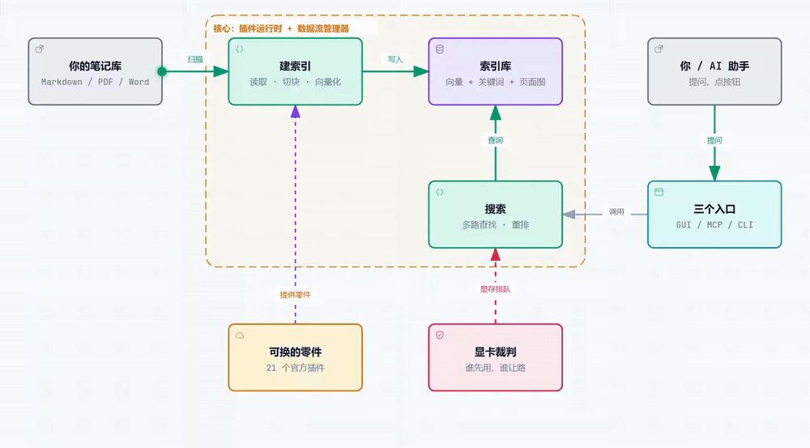
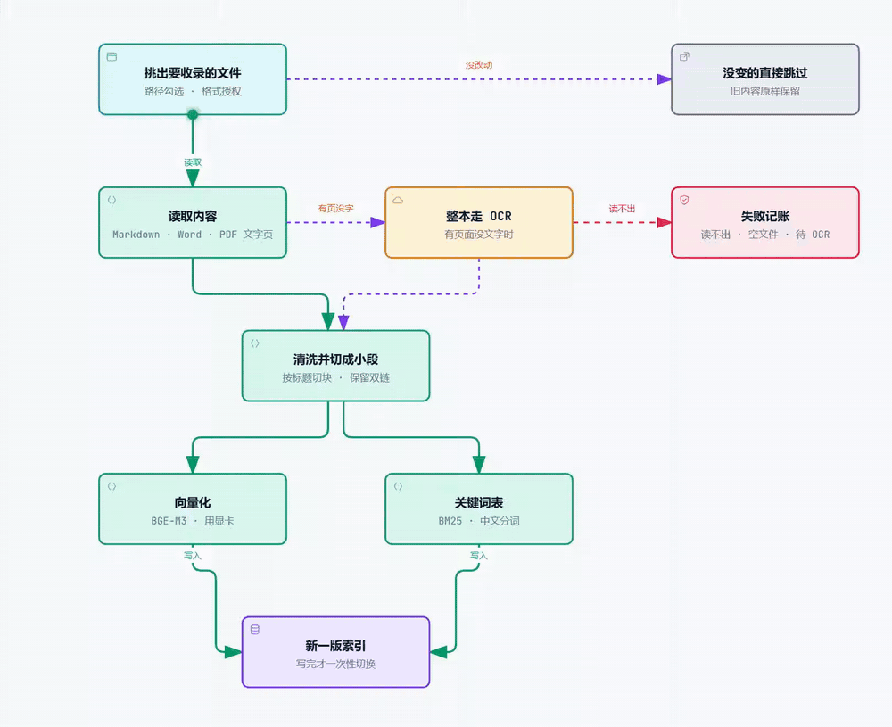
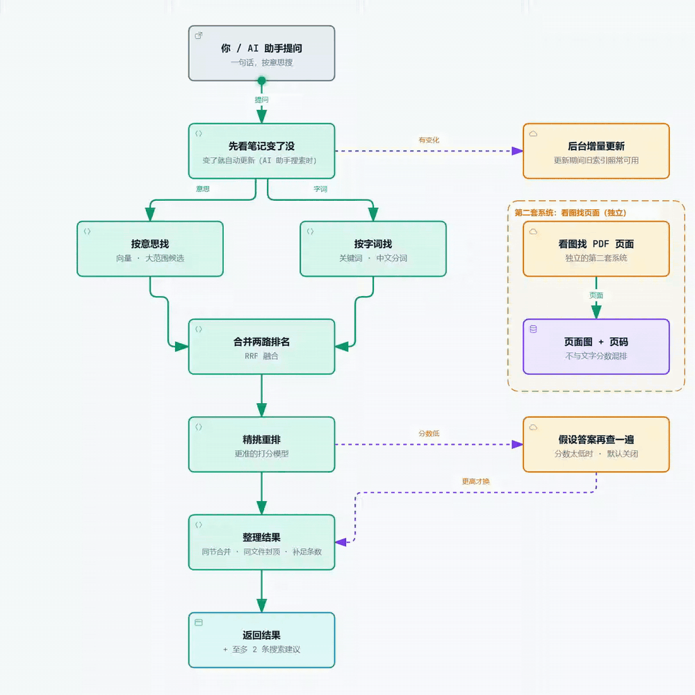
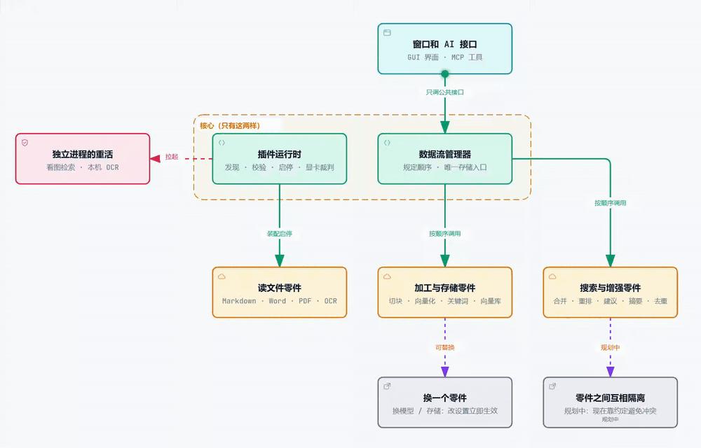
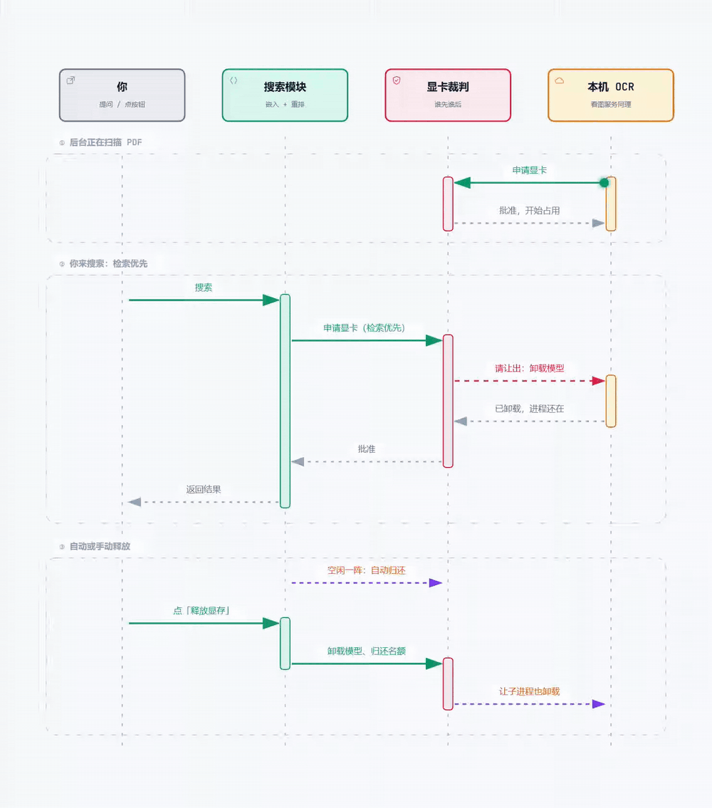
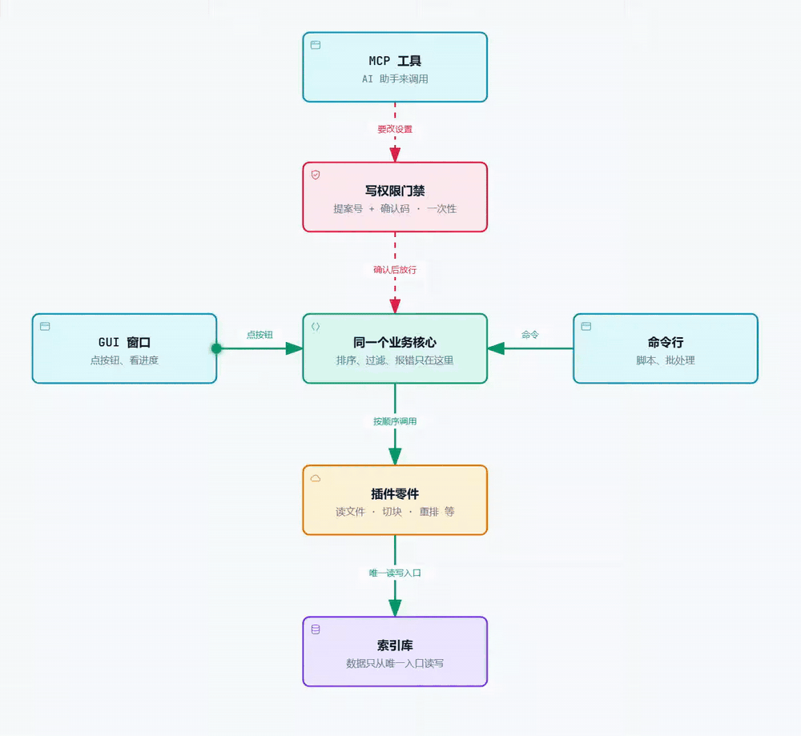
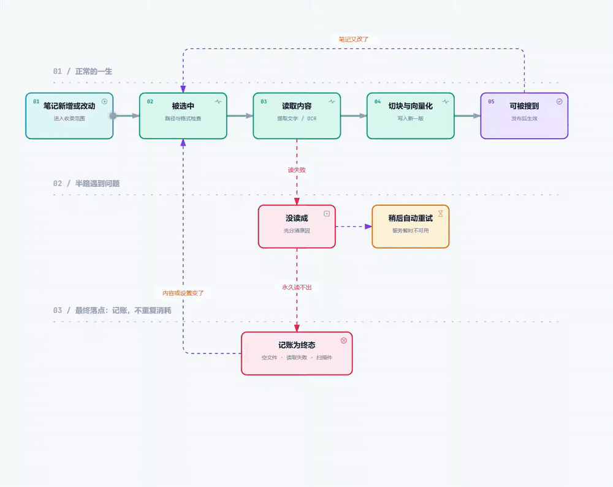

# 流程图集

这里是 RAG NAVIGATION 的 7 张动态流程图，小亮点沿着线走，表示数据或调用的流向。图会随 GitHub 的深色、浅色主题自动切换。

几点说明：

- 图是为了帮助理解的简化画法，细节以 [ARCHITECTURE.md](ARCHITECTURE.md)、[DATA_FLOW.md](DATA_FLOW.md) 和 [behavior_contract.json](behavior_contract.json) 为准。
- 虚线表示“可选”或“规划中”的部分。
- 图的源文件在 `docs/media/src/`，用 `docs/media/tools/build.sh` 可以重新生成 GIF。

---

## 1. 整体全景

笔记库经过“建索引”进入索引库；你或 AI 助手通过三个入口发起搜索；显卡裁判负责让不同的模型排队使用显卡。

  <picture>
    <source media="(prefers-color-scheme: dark)" srcset="media/01-overview-dark.gif" />
    
  </picture>

## 2. 建索引怎么跑

挑文件、读内容、切块、向量化和关键词，全部做完后一次性切换成新版索引。没改动的文件跳过，读不出的文件记账。

  <picture>
    <source media="(prefers-color-scheme: dark)" srcset="media/02-indexing-dark.gif" />
    
  </picture>

## 3. 一次搜索怎么跑

先看笔记有没有变，两路同时找，合并、重排、整理后返回。第一轮把握低时可以假设一个答案再查（默认关闭）。看图找页面是独立的第二套系统。

  <picture>
    <source media="(prefers-color-scheme: dark)" srcset="media/03-search-dark.gif" />
    
  </picture>

## 4. 插件怎么装配

核心只有两样：插件运行时和数据流管理器。其余都是可换的零件；较重的部分跑在独立的进程里。零件之间彼此隔离在规划中。

  <picture>
    <source media="(prefers-color-scheme: dark)" srcset="media/04-plugins-dark.gif" />
    
  </picture>

## 5. 显卡与后台进程不打架

后台正在扫描 PDF 时，你来搜索，检索优先，识别让出显卡；空闲后自动归还，也可以手动“释放显存”。

  <picture>
    <source media="(prefers-color-scheme: dark)" srcset="media/05-gpu-dark.gif" />
    
  </picture>

## 6. 三个入口共用同一个大脑

桌面窗口、命令行、AI 助手（MCP）都走同一个业务核心。AI 想改设置，要先过“写权限门禁”。

  <picture>
    <source media="(prefers-color-scheme: dark)" srcset="media/06-entrances-dark.gif" />
    
  </picture>

## 7. 一个文件的一生

从笔记新增或改动，到被选中、读取、切块向量化、最终可以被搜到。中途读不出来的，会区分“暂时不可用，稍后自动重试”和“永久读不出，记账为终态”；只有文件内容或设置变了，才会重新尝试。

  <picture>
    <source media="(prefers-color-scheme: dark)" srcset="media/07-lifecycle-dark.gif" />
    
  </picture>

